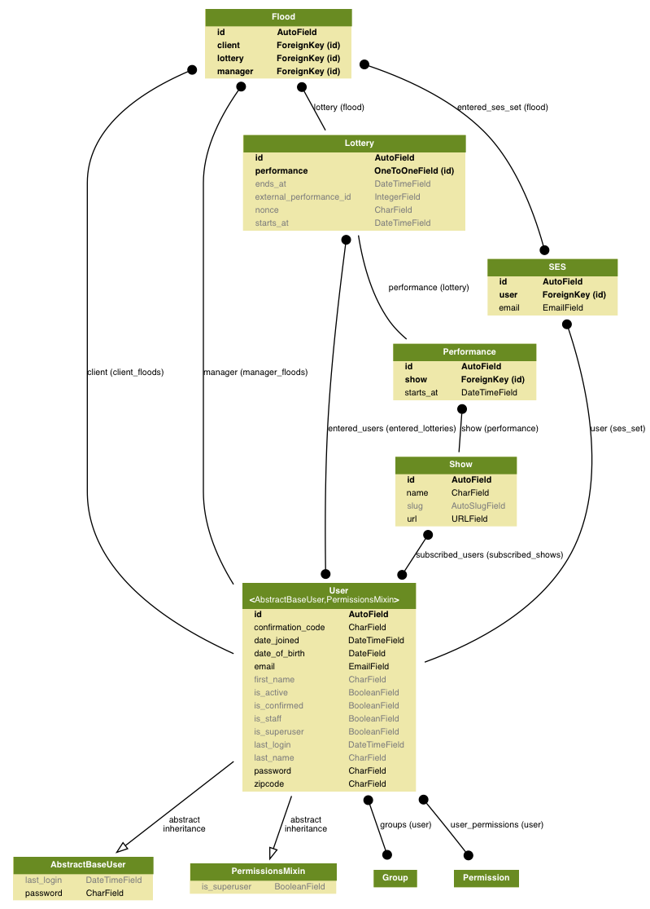

# Killington

## Dependencies

Production Dependencies

```
python 3.6
postgresql
rabbitmq
```

Local Dependencies

```
# To run python manage.py graph_models, install graphviz
brew install graphviz
```

## Quickstart

```
git clone git@github.com/massover/killington.git
cd killington
python3 -m venv venv
source venv/bin/activate
pip install -r requirements-dev.txt
make db
make serve
open http://localhost:8000
```

## Models



## Testing

The [pytest](https://github.com/pytest-dev/pytest) testing 
framework is used.

```
make test
```

## Deploy

Continuous deployment is used through Travis CI set up via Heroku.

```
make lint
piprot
make test
git push origin master
```


